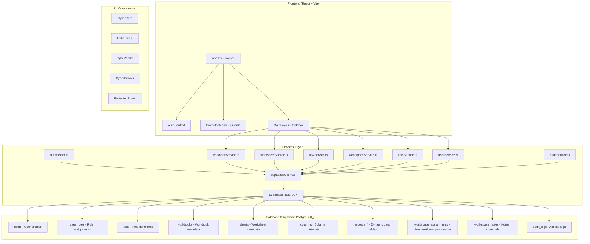

# System Overview

## Purpose

ER Tracker is a web-based spreadsheet data management and visualization platform that enables users to:
- Upload and manage Excel/CSV workbooks
- View and edit worksheet data in tabular or card formats
- Assign workbooks to users with granular permissions
- Track audit logs for data modifications
- Collaborate through shared and private notes on records

## Architecture

## Major Modules

| Module | Location | Purpose |
|--------|----------|---------|
| Authentication | `frontend/src/services/authHelper.ts` | Custom bcrypt-based login via Supabase |
| Workbook Engine | `frontend/src/services/workbookService.ts` | Workbook CRUD, import, delete |
| Worksheet Engine | `frontend/src/services/worksheetService.ts` | Sheet CRUD, column management |
| Row/Data Engine | `frontend/src/services/rowService.ts` | Record CRUD, hybrid localStorage fallback |
| Workspace Engine | `frontend/src/services/workspaceService.ts` | User assignments, notes, record notes |
| Role Engine | `frontend/src/services/roleService.ts` | Role CRUD, permission matrix |
| User Engine | `frontend/src/services/userService.ts` | User CRUD, password management |
| Audit Engine | `frontend/src/services/auditService.ts` | Audit logging, history retrieval |

## User Types

| Role | Access Level | Permissions |
|------|--------------|-------------|
| SuperAdmin | Full system access | All modules, all actions, user/role management |
| Admin | Administrative access | Workbooks, worksheets, users (limited), roles (read-only) |
| Manager | Operational access | Workbooks (limited), worksheets, reports |
| Analyst | Read-focused access | Dashboards, worksheets (view), reports |
| Viewer | Read-only access | Dashboards (view), no direct workbook/worksheet access |

## High-Level Flow

### Authentication Flow
1. User enters credentials on `/login` (Login.tsx)
2. `loginUser()` in authHelper.ts queries `users` table
3. bcrypt.compare validates password against `hashed_password`
4. Roles/permissions loaded via `user_roles` → `roles` joins
5. User data stored in localStorage as "appUser"
6. Auth context provides user state to protected routes

### Workbook Upload Flow
1. User selects .xlsx/.xls/.csv file on `/workbooks`
2. File parsed via xlsx library
3. Workbook record created in `workbooks` table
4. Worksheets created in `sheets` table
5. Columns created in `columns` table
6. Rows inserted into dynamic `records_<uuid>` tables
7. Progress tracked via CyberProgressModal

### Workspace Assignment Flow
1. SuperAdmin/Admin selects workbook on `/workbooks`
2. Assigns to user with permissions (can_edit, can_delete, can_export, notes_enabled)
3. Record inserted into `workspace_assignments`
4. RLS policy restricts access to assigned user (line 22-23 in migration)

## Screens Overview

| Route | Component | Path | Protected By |
|-------|-----------|------|--------------|
| `/login` | Login.tsx | Public | None |
| `/dashboard` | Dashboard.tsx | Protected | Workbooks:view |
| `/workbooks` | Workbooks.tsx | Protected | Workbooks:view |
| `/workbooks/:id` | WorkbookDetail.tsx | Protected | Workbooks:view |
| `/worksheets/:id` | Worksheet.tsx | Protected | Worksheets:view |
| `/workspace` | UserWorkspace.tsx | Public | None (shows assigned only) |
| `/workspace/workbook/:id` | WorkspaceWorkbook.tsx | Public | None (checks assignment) |
| `/users` | UserManagement.tsx | Protected | Users:view |
| `/roles` | RoleManagement.tsx | Protected | Roles:view |
| `/settings` | Settings.tsx | Protected | Settings:view |
| `/audit-history` | AuditHistory.tsx | Protected | Role:SuperAdmin |
| `/storage-management` | StorageManagement.tsx | Protected | Role:SuperAdmin |
| `/reports` | Reports.tsx | Protected | Reports:view |