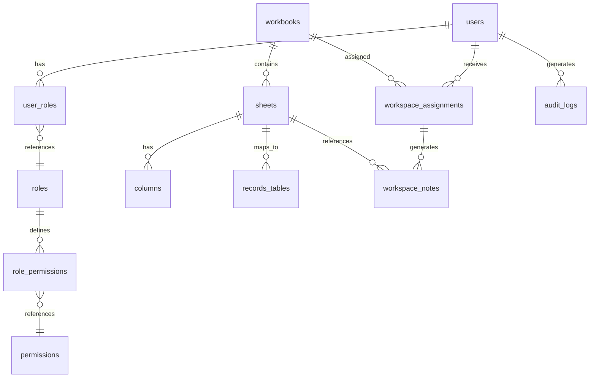
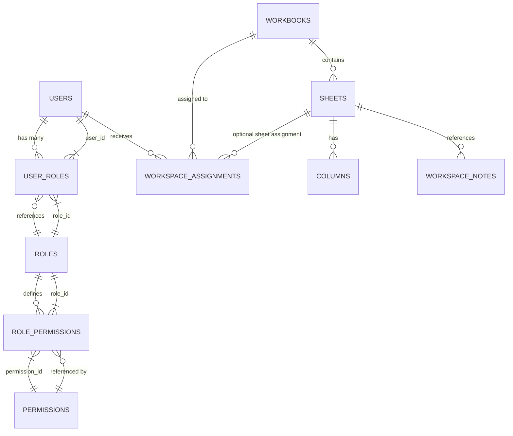

# Database Documentation

## Tables Overview

## Core Tables

### users
**Purpose**: User account profiles
**Location**: Referenced in userService.ts

| Column | Type | Constraints |
|--------|------|-----------|
| id | BIGINT (PK) | GENERATED BY DEFAULT AS IDENTITY |
| username | TEXT | UNIQUE, NOT NULL |
| hashed_password | TEXT | NOT NULL |
| is_active | BOOLEAN | DEFAULT true |
| created_at | TIMESTAMPTZ | DEFAULT NOW() |

**Used By**:
- Auth flow: authHelper.ts:108-109
- User management: userService.ts
- Workspace: workspace_assignments.assigned_by

**Referenced By**:
- user_roles.user_id (FK)
- workspace_assignments.user_id (FK)

### roles
**Purpose**: System role definitions
**Location**: Referenced in roleService.ts:17-27

| Column | Type | Constraints |
|--------|------|-----------|
| id | BIGINT (PK) | GENERATED BY DEFAULT AS IDENTITY |
| name | TEXT | UNIQUE, NOT NULL |
| description | TEXT | NULLABLE |

**Used By**:
- Role management UI
- Default matrix: roleService.ts:117-163

**Referenced By**:
- user_roles.role_id (FK)

### user_roles
**Purpose**: User-to-role assignments (many-to-many)
**Location**: Referenced in userService.ts:71-96, roleService.ts:30-33

| Column | Type | Constraints |
|--------|------|-----------|
| user_id | BIGINT | REFERENCES users(id) ON DELETE CASCADE |
| role_id | BIGINT | REFERENCES roles(id) |

**Note**: Composite primary key from user_id + role_id

### permissions
**Purpose**: Permission action definitions
**Location**: Referenced in roleService.ts

| Column | Type | Notes |
|--------|------|-------|
| id | BIGINT | Primary key |
| name | TEXT | Permission identifier (e.g., "Workbooks:view") |

### role_permissions
**Purpose**: Role-to-permission assignments
**Location**: Referenced in roleService.ts:36-46

| Column | Type | Notes |
|--------|------|-------|
| role_id | BIGINT | FK to roles |
| permission_id | BIGINT | FK to permissions |

**Note**: Used for RLS and UI permission checks. Currently DEFAULT_MATRIX is used instead for UI checks.

### workbooks
**Purpose**: Workbook metadata
**Location**: workbookService.ts:3-12, migrations

| Column | Type | Notes |
|--------|------|-------|
| id | BIGINT | Primary key |
| name | TEXT | Workbook name (e.g., filename) |
| uploaded_at | TIMESTAMPTZ | Timestamp of creation |

**Used By**:
- Workbook list: getWorkbooks()
- Worksheet queries: getWorksheets() filters by workbook_id

**Referenced By**:
- sheets.workbook_id (FK)
- workspace_assignments.workbook_id (FK)

### sheets
**Purpose**: Worksheet metadata
**Location**: worksheetService.ts:3-10

| Column | Type | Notes |
|--------|------|-------|
| id | BIGINT | Primary key |
| workbook_id | BIGINT | FK to workbooks |
| name | TEXT | Sheet name |
| created_at | TIMESTAMPTZ | Timestamp |
| updated_at | TIMESTAMPTZ | Timestamp |
| records_table_name | TEXT | Dynamic table name (added via migration 20260613000001:4) |

**Important**: `records_table_name` added via migration to resolve dynamic table mapping

**Used By**:
- Worksheet list
- Row queries: resolveRecordTable() probes this column

**Referenced By**:
- columns.sheet_id (FK)
- workspace_assignments.sheet_id (FK, nullable)
- workspace_notes.sheet_id (FK)

### columns
**Purpose**: Worksheet column definitions
**Location**: worksheetService.ts:12-20

| Column | Type | Notes |
|--------|------|-------|
| id | BIGINT | Primary key |
| sheet_id | BIGINT | FK to sheets |
| name | TEXT | Internal column name (sanitized) |
| inferred_type | TEXT | Type metadata (e.g., "text", "single-select:Option1,Option2") |
| is_hidden | BOOLEAN | Default false |
| display_order | INTEGER | Column ordering |

**Used By**:
- Worksheet rendering
- Row creation/update (hybrid payload split)

## Dynamic Tables

### records_<uuid>
**Purpose**: Actual worksheet row data
**Location**: Created dynamically per sheet, mapped via sheets.records_table_name
**Number of Tables**: Variable (23 tables defined in supabase_table_schemas.json)

**Columns**: Dynamic - matches uploaded spreadsheet headers
**Naming**: Sanitized from original headers (replaced non-alphanumeric with underscore)

**Evidence**: rowService.ts:52-86 defines SHEET_TO_RECORD_TABLE mapping

### workspace_assignments
**Purpose**: User workbook permissions and assignments
**Location**: workspaceService.ts:1-15, migration 20260613000000

| Column | Type | Notes |
|--------|------|-------|
| id | BIGINT | Primary key |
| user_id | BIGINT | FK to users |
| workbook_id | BIGINT | FK to workbooks |
| sheet_id | BIGINT | FK to sheets, NULLABLE |
| assigned_by | BIGINT | FK to users |
| can_edit | BOOLEAN | Default false |
| can_delete | BOOLEAN | Default false |
| can_export | BOOLEAN | Default true |
| notes_enabled | BOOLEAN | Default true |
| created_at | TIMESTAMPTZ | Default NOW() |

**RLS Policies** (migration lines 29-44):
- SuperAdmin: Full access (SELECT, INSERT, UPDATE, DELETE)
- Users: SELECT only own records

## Note Tables

### workspace_notes
**Purpose**: Notes on worksheet records (shared and private)
**Location**: workspaceService.ts:17-25, migration 20260614000000

| Column | Type | Notes |
|--------|------|-------|
| id | BIGINT | Primary key |
| user_id | BIGINT | FK to users |
| workbook_id | BIGINT | FK to workbooks |
| sheet_id | BIGINT | FK to sheets |
| assignment_id | BIGINT | FK to workspace_assignments |
| record_id | TEXT | NOT NULL - links to record in records_* table |
| is_private | BOOLEAN | Default false |
| title | TEXT | Optional title |
| content | TEXT | Note content |
| created_at | TIMESTAMPTZ | Default NOW() |
| updated_at | TIMESTAMPTZ | Default NOW() |

**Indexes** (migration):
- `idx_workspace_notes_record` on (sheet_id, record_id)
- `idx_workspace_notes_user` on (user_id)

**RLS**: DISABLED (migration line 24)

## Audit Tables

### audit_logs
**Purpose**: System-wide audit trail
**Location**: auditService.ts, migration 20260614000000

| Column | Type | Notes |
|--------|------|-------|
| id | BIGINT | Primary key |
| user_id | BIGINT | FK to users |
| timestamp | TIMESTAMPTZ | Default NOW() |
| action | TEXT | Action type |
| table_name | TEXT | Affected table |
| record_id | TEXT | Affected record |
| payload | JSONB | Additional data |

**RLS**: DISABLED (migration line 42)

## Relationships Diagram

## Risks and Constraints

### Primary Keys
- Current schema uses BIGINT, not UUIDs
- May conflict with Supabase default UUID expectations

### Foreign Key Constraints
- Missing explicit FK constraints on some tables
- workspace_notes has optional workbook_id/sheet_id

### Soft Delete Columns
- `deleted_at`, `deleted_by` columns referenced in code (rowService.ts:645-648)
- May not exist in all records_* tables

### Missing Constraints
- `user_roles` lacks explicit primary key declaration in migrations
- `workspace_notes.record_id` is TEXT, not constrained to records_* tables

### RLS Limitations
- workspace_notes and audit_logs have RLS DISABLED
- All users can read/write these tables if they have Supabase API access
- Only UI-level permission checks protect data