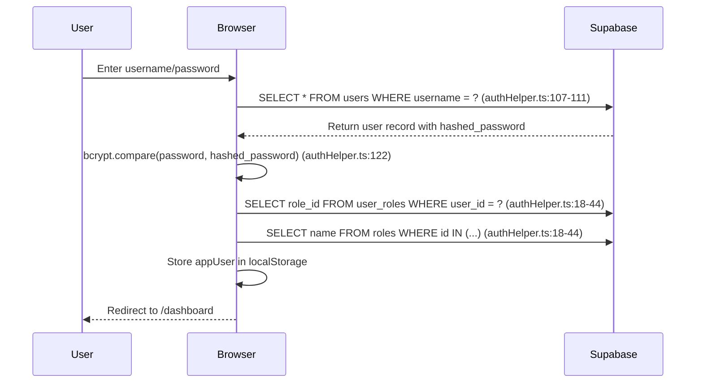
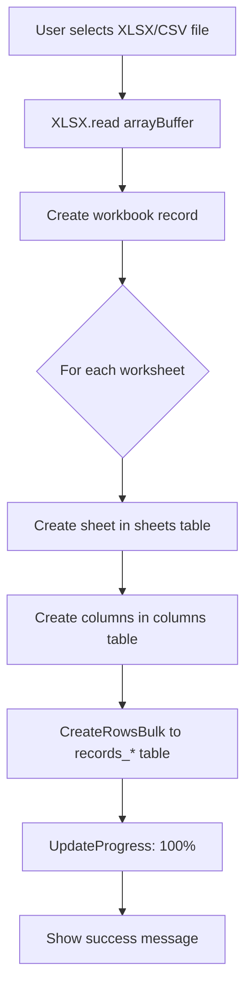
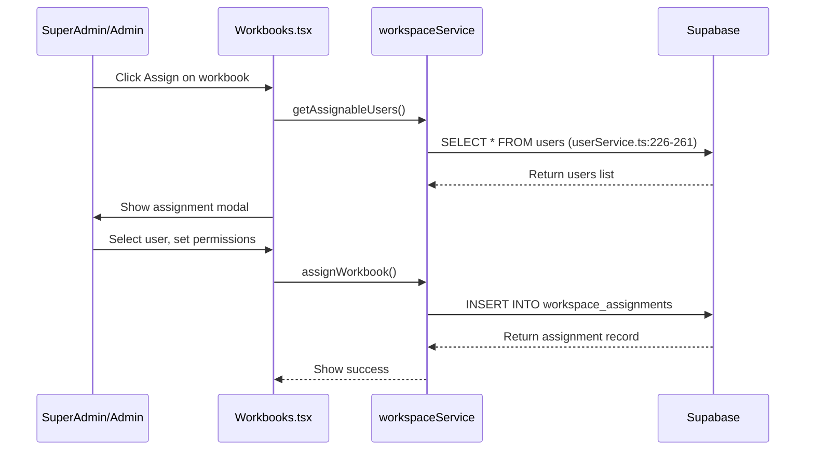
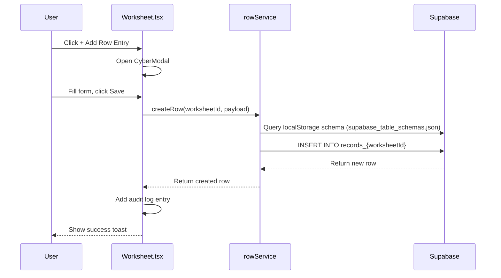
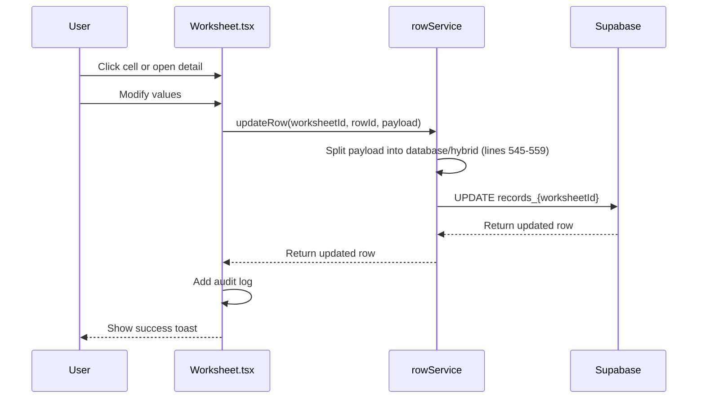
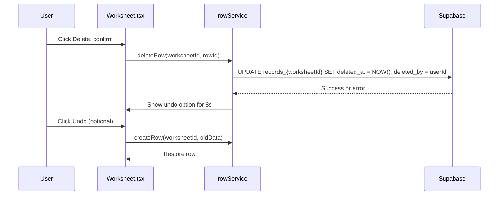
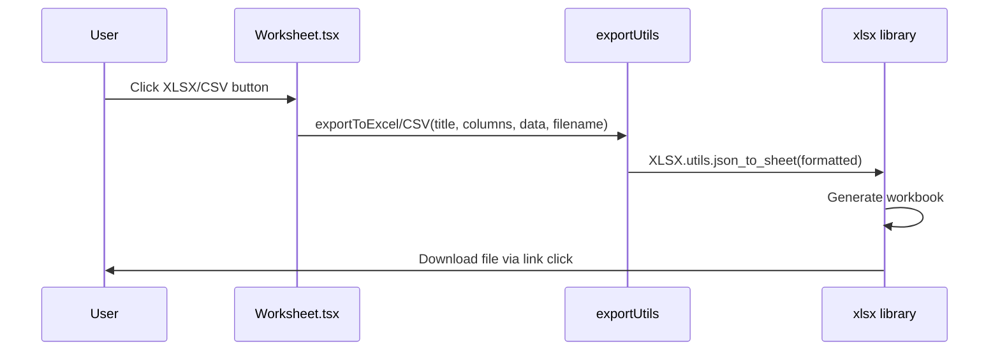
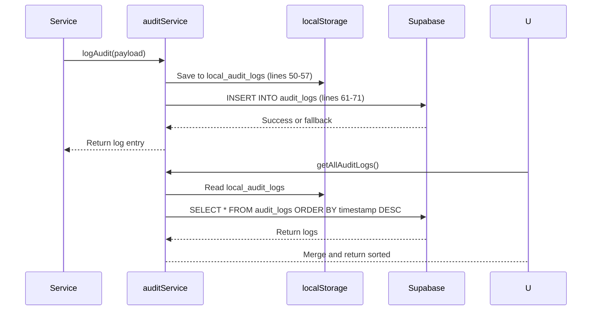
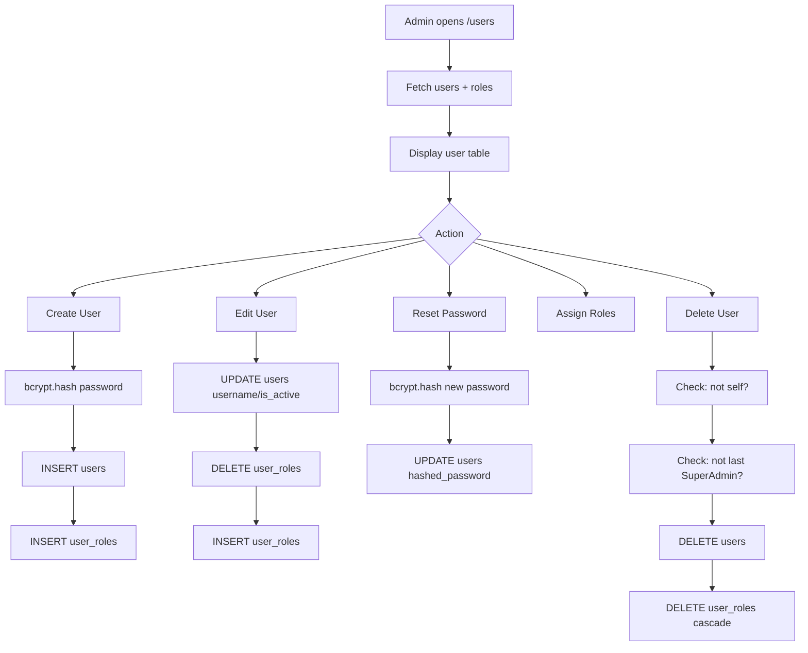
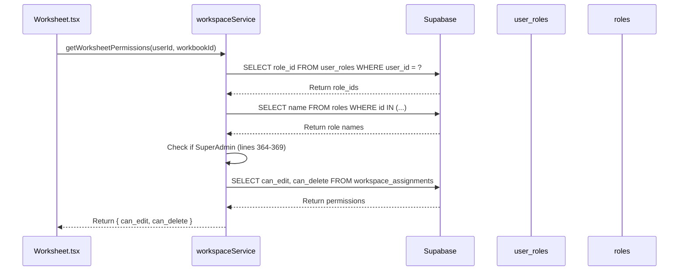

# Workflows

## Login Workflow



## Workbook Upload Workflow



**Code Path** (Workbooks.tsx:83-254):
1. lines 87-90: File validation
2. lines 129-130: `createWorkbook()`
3. lines 159-222: Sheet/column/row creation loop
4. lines 206-209: Progress modal updates

## Workbook Assignment Workflow



**Evidence**: Workbooks.tsx:304-388, workspaceService.ts:167-212

## Worksheet Access Workflow

```mermaid
flowchart TD
    A[User navigates to /workspace/workbook/{id}] --> B[Fetch worksheets for workbook]
    B --> C{For each worksheet}
    C --> D[Fetch columns]
    C --> E[Fetch rows]
    E --> F{Table exists?}
    F -->|Yes| G[Query records_* table]
    F -->|No| H[localStorage fallback]
    D --> I[Render CyberTable]
    G --> I
    H --> I
    I --> J[Subscribe to realtime]
```

## Create Record Workflow



## Edit Record Workflow



## Delete Record Workflow



**Code Evidence**: rowService.ts:639-682 (soft delete with fallback), Worksheet.tsx:1068-1089 (undo)

## Export Workflow



## Audit Log Workflow



## User Management Workflow



## Workspace Permission Check Flow

