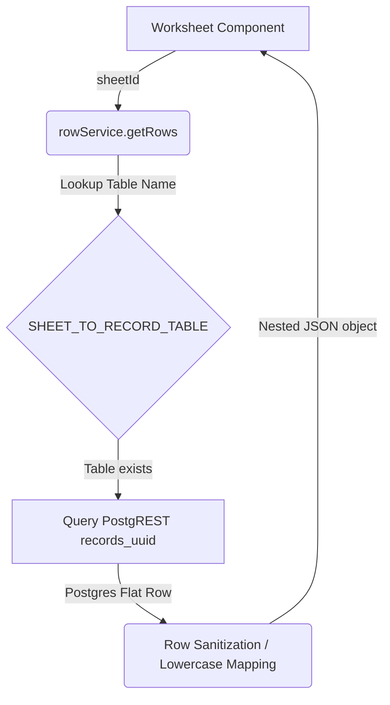

# Workbook Platform Phase 3 Architecture

This document describes the architectural layout, data pipelines, and database synchronizations for the Workbook Platform in Phase 3.

---

## 1. Live Database Schema Mappings

The workbook data engine utilizes Supabase (Postgres) and standardises all workbook mappings without modifying the underlying database structure. The core schema mappings are resolved as follows:

*   **Workbooks (`workbooks`)**: Top-level containers containing metadata for imported spreadsheets. Probed columns are limited to `id`, `name`, and `uploaded_at` (no `status` or `user_id` columns exist in the live database schema).
*   **Sheets (`sheets`)**: Sub-sheets mapped directly to workbooks (previously assumed table name `worksheets` did not exist).
*   **Columns (`columns`)**: Column schemas. The query interface maps columns via `sheet_id` (previously mapped via legacy `worksheet_id`).
*   **Users (`users`)**: Probed columns are limited to `id`, `username`, `hashed_password`, and `is_active` (no `created_at` column exists in the live database schema).
*   **User Roles (`user_roles`)**: Maps users to global security clearances. Correctly references user identities globally instead of workbook identifiers.

---

## 2. Flat Record Table Resolution (`records_<uuid>`)

Each worksheet records its data row arrays into a dedicated flat SQL table named `records_<uuid>`.
To locate the target database table for any given worksheet, we perform a concurrent probe of database table schemas or utilize a lookup mapping:

```typescript
export const SHEET_TO_RECORD_TABLE: Record<string, string> = {
  "3": "records_48b55739782c4ebca88a28207541c214",
  "8": "records_1be0d50ccafb4b9b940989f6ff8cd601",
  // Additional dynamic mappings probed dynamically
};
```

---

## 3. Postgres Column Accessor Folding

Postgres by default folds unquoted column names to lowercase. To avoid mismatches when querying columns or writing updates:
1.  **Select Queries**: Column lists must sanitize query parameters to lowercase when selecting from PostgREST.
2.  **Row Sanitization**: The row service translates database rows into nested `{ id, data: { [columnName]: value } }` structures. When writing updates or inserting rows, the code maps the raw payload fields to the database columns in a case-insensitive manner.

---

## 4. Operational Telemetry Flow



---

## 5. Floating Banners & State Recovery

During bulk or single deletion:
*   Deleted records are cached in frontend state.
*   A Cyberpunk Floating Notification banner is displayed with an "Undo" trigger.
*   Clicking "Undo" restores the record to state and performs a bulk insert/update write-back to Supabase.
*   A countdown timer automatically clears the deleted cache after 10 seconds if no undo is requested.
